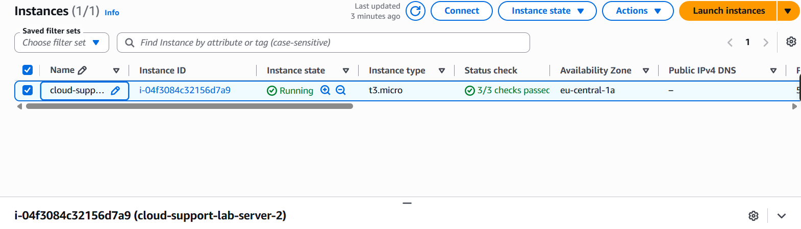
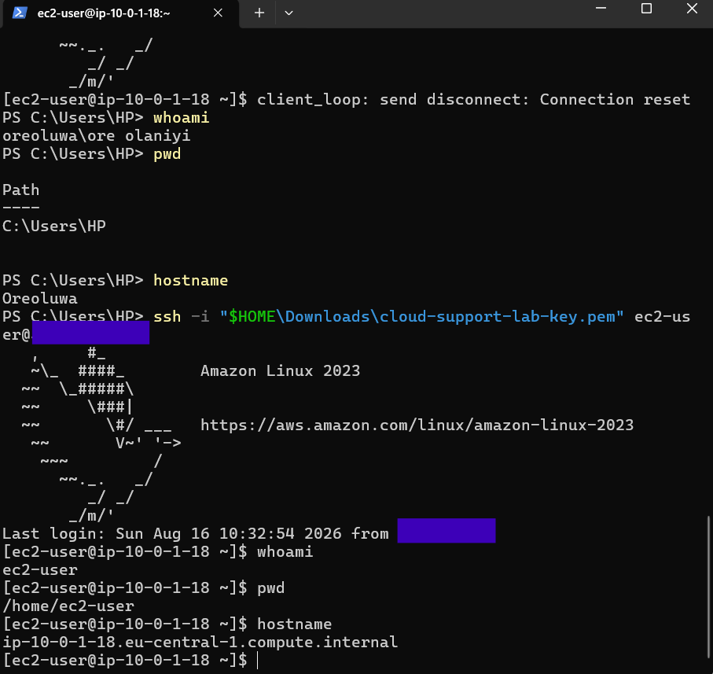
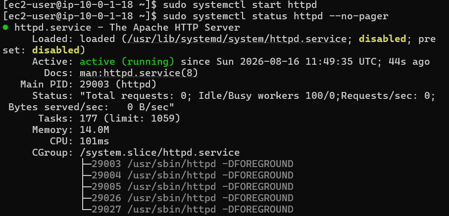
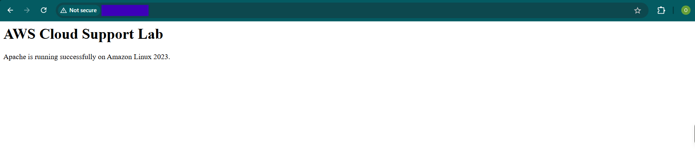

## EC2 and web server setup

I launched an Amazon Linux 2023 EC2 instance in the public subnet created for this lab.

The instance used a `t3.micro` instance type with an 8 GiB gp3 root volume. I used my existing SSH key pair and enabled a public IPv4 address so I could connect to the server from my Windows laptop.

SSH access was limited to my current public IP on port 22 through the EC2 security group.

### Connecting to the instance

I connected from Windows PowerShell using SSH and the private key stored on my laptop.

After connecting, I checked the user, working directory and hostname to confirm I was on the EC2 instance.

I also used commands including `free -h`, `df -h`, `lscpu`, `ip addr` and `ip route` to check the instance resources and network configuration.

The instance had the private IP `10.0.1.18/24`, which matched the `10.0.1.0/24` subnet created earlier.

I tested outbound internet access with `curl` and received a successful HTTP response.

### Apache web server

I updated the instance packages and installed Apache (`httpd`) using `dnf`.

After installation, I checked the service and found it was inactive. I started it with `systemctl` and enabled it so that it would start automatically after a reboot.

I then confirmed that Apache was listening on TCP port 80.

My first request to `http://localhost` returned `403 Forbidden`. I checked `/var/www/html` and found that the document root was empty.

I created a basic `index.html` page and tested again. This time Apache returned `HTTP/1.1 200 OK`.

I then added an HTTP rule for port 80 to the EC2 security group and confirmed that the page could be reached from my browser.

### Screenshots

EC2 instance running:

Successful SSH connection:

Apache running:

403 check and fix:

Web page accessed from the browser:

