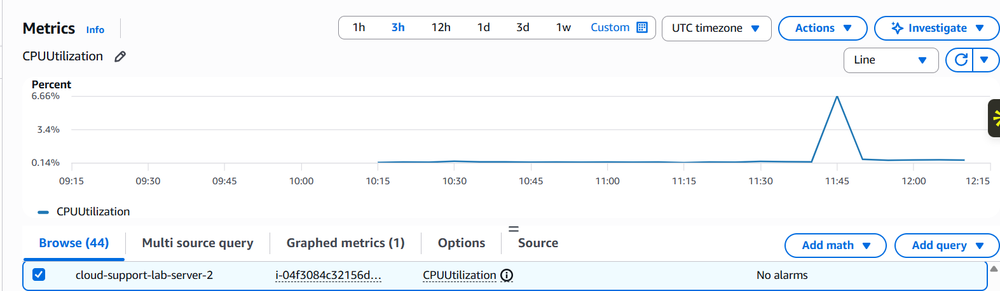
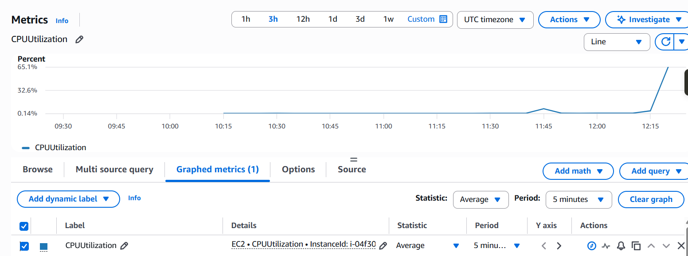
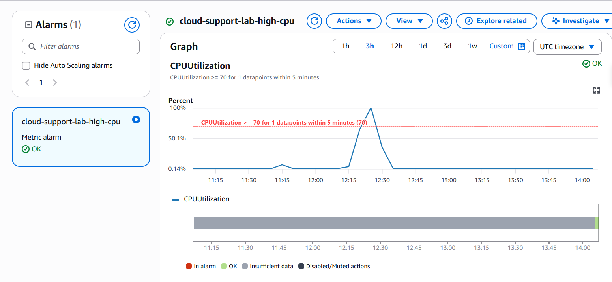
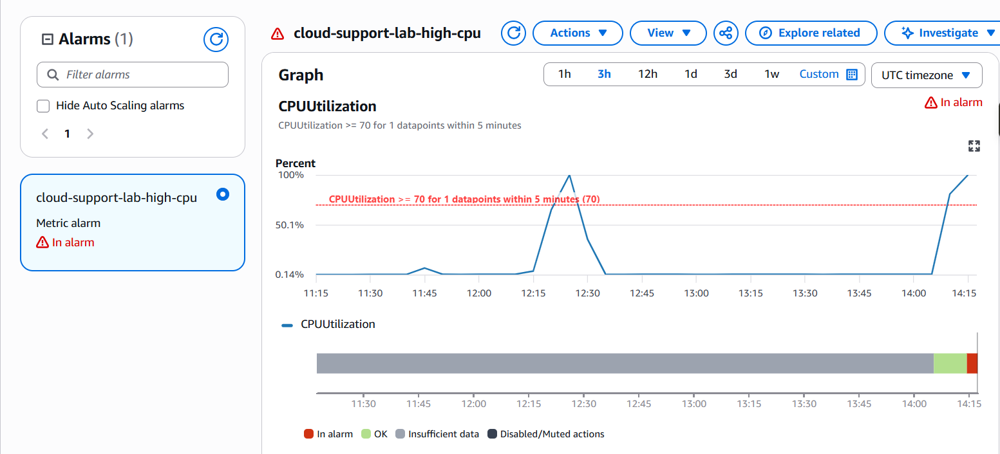

## CloudWatch monitoring

After getting the EC2 instance and Apache web server running, I used Amazon CloudWatch to monitor the instance.

### CPU monitoring

I started by checking the standard EC2 `CPUUtilization` metric in CloudWatch.

The initial CPU utilisation was low, which gave me a baseline before generating additional load on the server.

To test how CloudWatch responded to increased CPU activity, I installed `stress-ng` on the EC2 instance and ran two CPU workers.

The CPU utilisation increased significantly and the change appeared in the CloudWatch graph.

### CPU alarm

I created a CloudWatch alarm called:

`cloud-support-lab-high-cpu`

The alarm monitored the EC2 `CPUUtilization` metric and used a static threshold of:

`CPUUtilization >= 70%`

The period was set to 5 minutes with 1 out of 1 datapoints required to trigger the alarm.

After the alarm initially entered the `OK` state, I ran another controlled CPU stress test.

CloudWatch detected the increased CPU utilisation and the alarm changed from:

`OK -> In alarm`

When the stress test finished and CPU utilisation dropped again, the alarm automatically returned to:

`OK`

I also configured an SNS topic for email notifications. The CloudWatch alarm itself worked correctly, but the email subscription did not remain subscribed, so I did not receive the alarm notification by email. I have left this in the documentation rather than recording the notification test as successful.

### Screenshots

CPU baseline:

CPU under load:

Alarm in OK state:

Alarm triggered:

