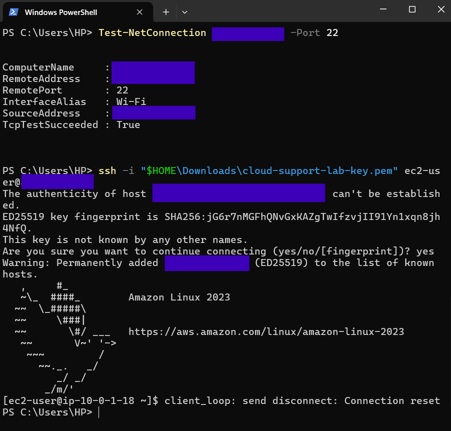
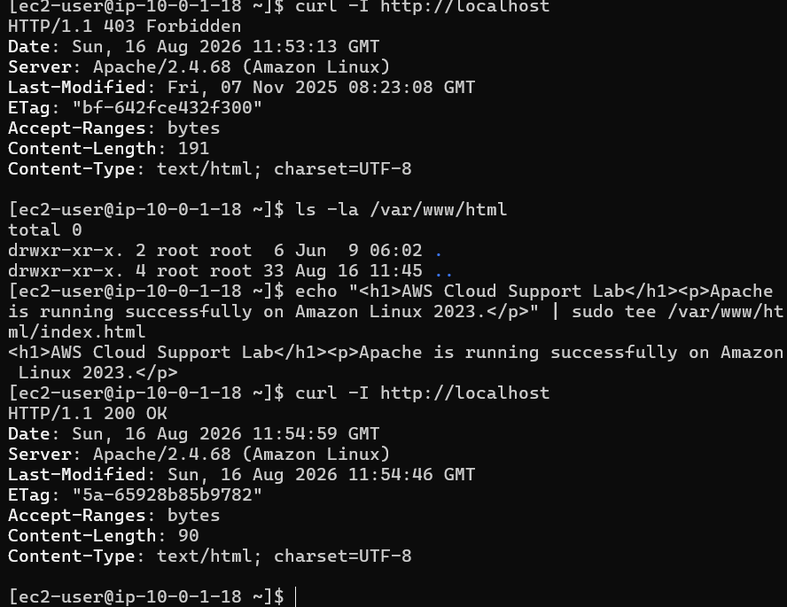
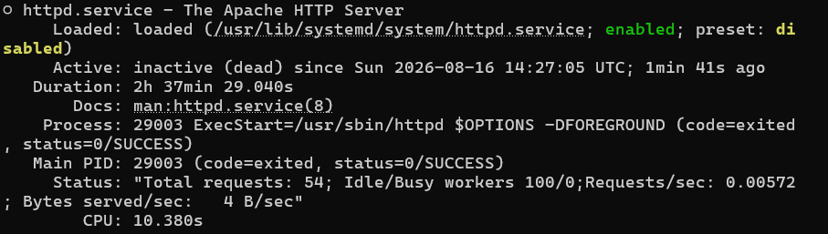
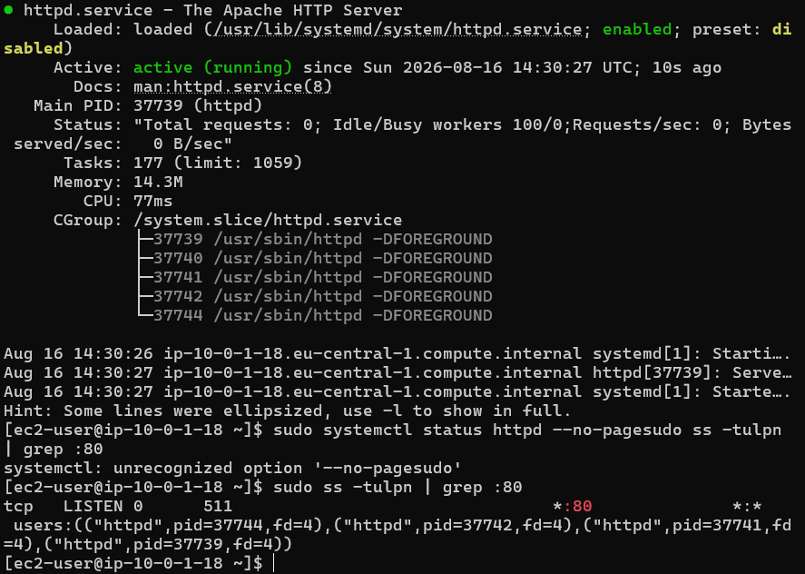

## Troubleshooting notes

During this lab I ran into several issues while configuring and testing the environment. I documented the checks I used and what eventually resolved each problem.

### 1. SSH connection timeout

#### Problem

My first EC2 instance passed its AWS health checks, but SSH connections from my Windows laptop timed out.

I checked the VPC routing, Internet Gateway, subnet, Network ACL, security group, public IP association and EC2 status checks. I also tried EC2 Instance Connect and tested from another network, but TCP port 22 still timed out.

After rebuilding the EC2 instance, I tested port 22 from PowerShell using `Test-NetConnection`.

The test initially failed again.

#### Cause

The security group SSH rule was restricted to a `/32` public IP address. My current public IP had changed, so the source address in the security group no longer matched my laptop's connection.

#### Resolution

I updated the SSH security group rule to use my current public IP.

I tested TCP port 22 again and received:

`TcpTestSucceeded : True`

I was then able to SSH successfully into the Amazon Linux instance.

This reinforced the importance of checking the client's current public IP when SSH access is restricted to a `/32` address.

### 2. Apache returned 403 Forbidden

#### Problem

After starting Apache, I tested the server locally with:

`curl -I http://localhost`

Apache responded with:

`HTTP/1.1 403 Forbidden`

#### Investigation

I checked the Apache document root:

`ls -la /var/www/html`

The directory was empty.

#### Resolution

I created a simple `index.html` file in `/var/www/html` and repeated the local HTTP test.

The response changed to:

`HTTP/1.1 200 OK`

I then allowed HTTP port 80 through the EC2 security group and successfully accessed the page from my browser.

### 3. Simulated website outage

After the web server was working, I performed a controlled troubleshooting exercise based on a support ticket reporting that users could no longer access the website.

Apache was deliberately stopped to create the fault.

#### Symptom

Refreshing the website from my laptop produced a connection refused error.

Instead of immediately changing AWS networking settings, I checked the service on the Linux instance:

`sudo systemctl status httpd --no-pager`

The result showed:

`Active: inactive (dead)`

I then checked whether anything was listening on TCP port 80:

`sudo ss -tulpn | grep :80`

There was no output, confirming that no process was listening on the web server port.

#### Resolution

I restarted Apache:

`sudo systemctl start httpd`

The service status changed to:

`Active: active (running)`

I checked port 80 again and confirmed that `httpd` was listening on `*:80`.

Finally, I refreshed the website from my laptop and confirmed that it was accessible again.

#### What I took from this

The browser's "connection refused" message helped narrow down the investigation. The instance was reachable, but the application service was not accepting connections.

Checking the service and listening ports before changing VPC or security group settings avoided unnecessary network changes.

### Screenshots

SSH connectivity test:

Apache 403 investigation:

Apache service inactive during simulated outage:

Apache service restored and listening on port 80:

