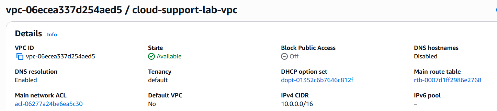
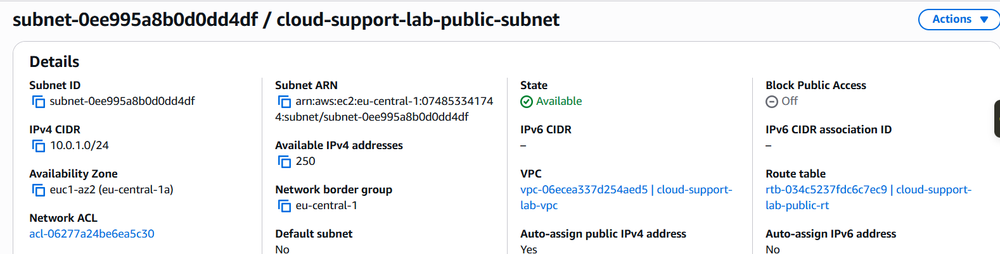
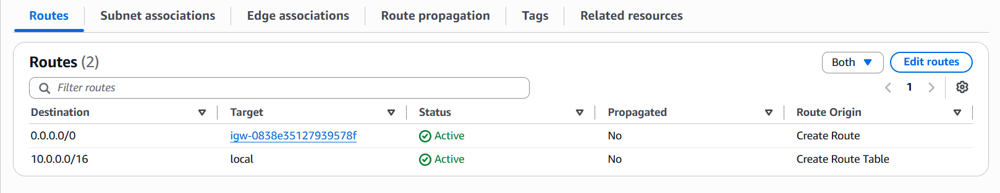
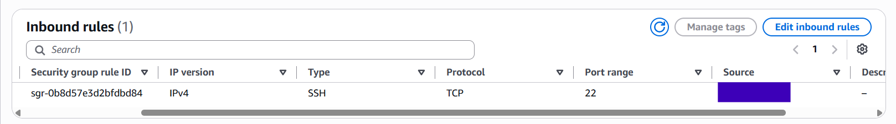

## VPC setup

I created a separate VPC for the lab so I could work through the networking setup instead of using the default VPC.

The VPC used the CIDR block:

`10.0.0.0/16`

Inside it, I created a public subnet:

`10.0.1.0/24`

The subnet was placed in `eu-central-1a`.

I then created and attached an Internet Gateway to the VPC and added a custom route table. The route table included:

`10.0.0.0/16 -> local`

`0.0.0.0/0 -> Internet Gateway`

The public subnet was associated with this route table, and auto-assign public IPv4 was enabled so the EC2 instance could receive a public IP address.

For the EC2 security group, I kept SSH restricted to my current public IP using a `/32` rule instead of opening port 22 to the whole internet.

HTTP on port 80 was added later when I installed Apache and needed to test the web server from my browser.

## Screenshots

VPC configuration:

Public subnet:

Route table:

Security group:

